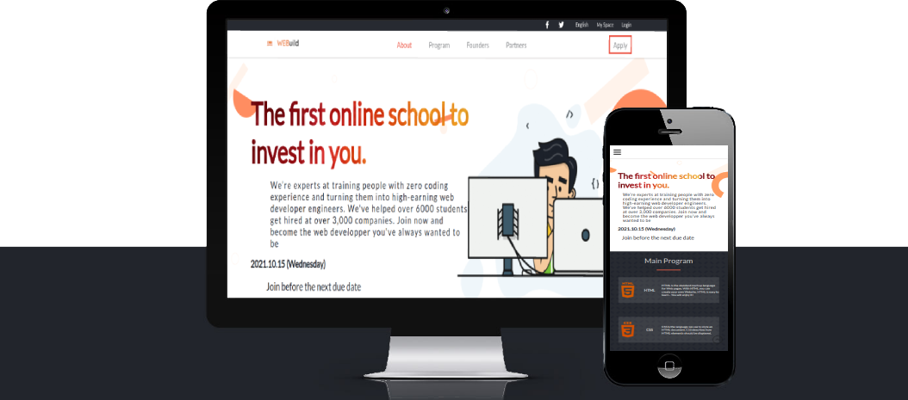

# Project Name

> WEBuild.

This Website is built for Microverse as a capstone (final project) for the first module. The project is a website for a bootcamp that would teach its students web devolopment. Most of the rights in this project are reserved. However, Everything used in the project either names, purposes.. are fictional and any resemblance to actual events or locales or persons or commercial projects is entirely coincidental.

## Built With

- HTML, CSS, JavaScript
- VS Code

## Live Demo

[Live Demo Link](https://livedemo.com)

## Getting Started

To get a local copy up and running follow these simple example steps.

### Prerequisites

- VSCODE / Live HTTP Server

- OS with Git installed on it

### Setup

**Run** git clone https://github.com/AmineHLub/Capstone-1.git

## Authors

👤 **Author1**

- GitHub: [@AmineHLub](https://github.com/AmineHLub)
- Twitter: [@Amino47612441](https://twitter.com/Amino47612441)
- LinkedIn: [LinkedIn](https://www.linkedin.com/in/mohamed-amine-hajltaief-b18863163/)

## 🤝 Contributing

Any contributing is welcome

Feel free to check the [issues page](https://github.com/AmineHLub/Capstone-1/issues).

## Show your support

Give a ⭐️ if you like this project!

## Acknowledgments

- This project is for microverse but the original design belongs to [Cindy Shin in Behance](https://www.behance.net/adagio07).

- [The original design](https://www.behance.net/gallery/29845175/CC-Global-Summit-2015).

- The logo is made using [Adobe sparks logo creator online](https://www.adobe.com/express/create/logo).

- Images of speakers are licensed under [freepic](https://www.freepik.com/vectors/people)'s standard license.

- This project belongs to [Microverse](https://microverse.org/).

## 📝 License

- This project is [MIT](./licenses/MIT.md) licensed.
- [Freepik]((./licenses/FREEPIK.md)) License 
- [Adobe]((./licenses/ADOBE.md)) License
